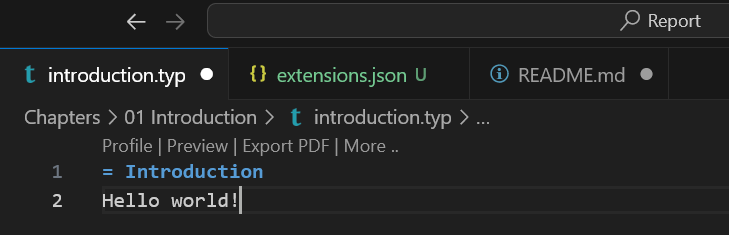

# Report

## Setup

This report is written in typst. If using VSCode, the simplest way to compile is using [Tinymist](https://github.com/Myriad-Dreamin/tinymist/tree/main/editors/vscode).

Quick start: while working on the report, the simplest is to open a preview in either another tab or a browser. You can preview from any `.typ` file (if you want to see the entire report, choose `main.typ`).

Select the file you want to preview from, and in the top you will see an option called 'Preview' - you can also press 'More' → 'Preview in':

